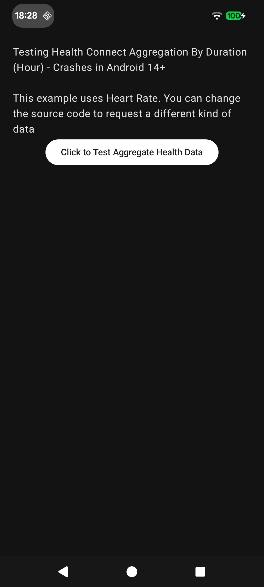

# Health Connect Crash reproduction

Google Issue Tracker: https://issuetracker.google.com/issues/421325344

This repository contains a simple android app to reproduce a crash in HealthConnect's `aggregateGroupByDuration`. Clicking the button below will crash the app in Android 14 and above.



Crash stacktrace:

```
java.lang.IllegalArgumentException: start time must be before end time
    at androidx.health.connect.client.aggregate.AggregationResultGroupedByDuration.<init>(AggregationResultGroupedByDuration.kt:42)
    at androidx.health.connect.client.impl.platform.response.ResponseConvertersKt.toSdkResponse(ResponseConverters.kt:85)
    at androidx.health.connect.client.impl.HealthConnectClientUpsideDownImpl.aggregateGroupByDuration(HealthConnectClientUpsideDownImpl.kt:283)
    at androidx.health.connect.client.impl.HealthConnectClientUpsideDownImpl$aggregateGroupByDuration$1.invokeSuspend(Unknown Source:15)
    at kotlin.coroutines.jvm.internal.BaseContinuationImpl.resumeWith(ContinuationImpl.kt:33)
    at kotlinx.coroutines.DispatchedTask.run(DispatchedTask.kt:108)
    at kotlinx.coroutines.scheduling.CoroutineScheduler.runSafely(CoroutineScheduler.kt:584)
    at kotlinx.coroutines.scheduling.CoroutineScheduler$Worker.executeTask(CoroutineScheduler.kt:793)
    at kotlinx.coroutines.scheduling.CoroutineScheduler$Worker.runWorker(CoroutineScheduler.kt:697)
    at kotlinx.coroutines.scheduling.CoroutineScheduler$Worker.run(CoroutineScheduler.kt:684)
```

This `start time must be before end time` is thrown in `AggregationResultGroupedByDuration` class.

```kotlin
class AggregationResultGroupedByDuration
@RestrictTo(RestrictTo.Scope.LIBRARY_GROUP)
constructor(
    public val result: AggregationResult,
    public val startTime: Instant,
    public val endTime: Instant,
    public val zoneOffset: ZoneOffset,
) {
    init {
        require(startTime.isBefore(endTime)) { "start time must be before end time" }
    }
    // ...
}
```

When creating certain intervals for aggregation result, and sliced every hour, the crash occurs.

As an example, the app creates 20 splits from the past 6 months with `LocalDateTime`, and does 20 calls (sequentially) to `aggregateGroupByDuration`, It crashes on the 13th - splitStart=2025-03-24T18:00; splitEnd=2025-04-03T06:00.

When debugging, the crash occurs because for the last hour slice, 2025-04-03T05:00-2025-04-03T06:00, the `endDate` is at 05:00 (same as start) instead of 06:00.
Why it crashes for that split in particular, I'm not sure, but at least it's consistent.

From my tests it only happens in Android 14 devices and above, which would indicate the problem lies somewhere in the HealthConnect SDK's implementation for those versions (`HealthConnectClientUpsideDownImpl`), or on the actual android Framework code.

Timezone that I tested with is London (at the time of writing it's BST or GMT+1).
